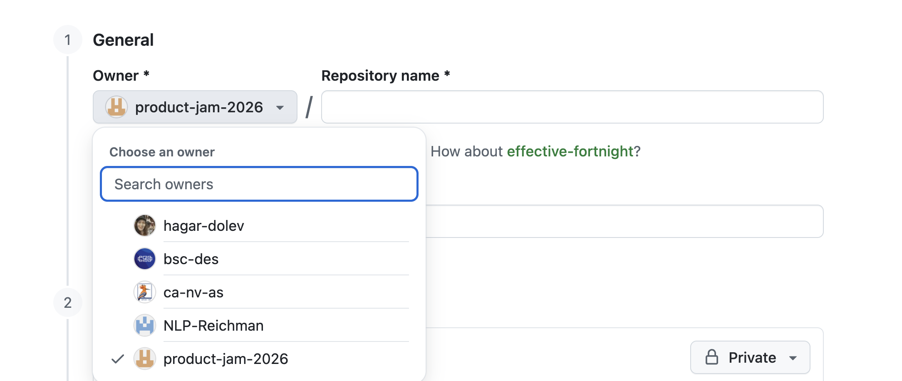

# 01 - Personal Website

**Due October 29**

The goal of the assignment is to get you to do some basic HTML and CSS editing
to create a web page, and then deploy that to the web. This will demonstrate a
basic understanding of web technologies.

## Submission

- [Review the assignment submission process here](https://github.com/product-jam-2026/course#assignments)
- [Submit your assignment here](https://github.com/product-jam-2026/course/issues/2)

## Setup

1. Create your own copy of the
   [ex1 template repository](https://github.com/product-jam-2026/ex1-template).

   - Give your repository a name that is unique to you, for example
     `yonatan-website`
   - Make sure your copy lives under your own username, i.e.:
     `https://github.com/<your_user>/<repo_name>`
   

2. Clone the remote repository to your local computer using Git from your
   development machine:
   - **[`git clone`](https://docs.github.com/en/repositories/creating-and-managing-repositories/cloning-a-repository)**
3. Visit the repository directory on your local filesystem, and open it in VS
   Code
   - [via the command line](https://code.visualstudio.com/docs/editor/command-line#_launching-from-command-line)
   - or [via the app](https://code.visualstudio.com/docs/introvideos/basics)
4. You should now have VS Code open at the folder of the Git repository that you
   cloned from your GitHub account. Click on the `README.md` file to open it in
   VS Code.
5. Follow the instructions in the `README.md` file to:
   - Install project dependencies
   - Run the server
   - See the running app in a browser

## Tasks

### 1. Style using CSS

In your browser, open the link to `elements.html`. In VS Code, open `main.css`.

1. Edit CSS variables

   You are given several
   [CSS Variables](https://developer.mozilla.org/en-US/docs/Web/CSS/Using_CSS_custom_properties)
   that control the design of the HTML. Play with the values and see how they
   change different HTML elements. Select colors that you like for the design of
   your website.

2. Add custom fonts

   Find fonts that you like on [Google Fonts](https://fonts.google.com/) and
   change the fonts on the website to match your style. Use `@import` to include
   the fonts, as seen in `main.css`.

3. Add custom styles

   Play around with the CSS itself defined in `main.css`. Add or remove CSS
   rules and define new CSS variable as you see fit.

### 2. Add content to the HTML

Open `index.html` in your browser and VS Code.

1. Main page

   Remove the demo content and add your own instead. Use
   [Flexbox](https://developer.mozilla.org/en-US/docs/Learn/CSS/CSS_layout/Flexbox)
   to layout your page. Make sure your content includes all of the following
   HTML elements:

   `
` `<header>` `<footer>` `<h1>` `
` ` ` `<a>` `` `<button>`

2. Another page

   Copy `index.html` and add another page to your website. This page can contain
   whatever you wish. Add a link from the home page to the new page.

### 3. Add interactivity with JavaScript

- Use JavaScript to create a simple interaction

  Use javascript to add and remove a class from an element. This can happen when
  clicking a button, when hovering over and element, or on
  [any event that you wish](https://developer.mozilla.org/en-US/docs/Web/API/EventTarget/addEventListener).
  Animate the appearance of the element using
  [CSS transitions](https://developer.mozilla.org/en-US/docs/Web/CSS/CSS_transitions/Using_CSS_transitions).

## Deployment

After completing the tasks above, you should deploy your website with Vercel:

1. Upload to GitHub

   Once you have made the changes you want, and your code works locally, you
   need to `commit` your changes with Git, and `push` your changes to GitHub.

2. Deploy with Vercel

   We use [Vercel](https://vercel.com) to host all our web pages and apps on the
   Internet. Pushing code to a web hosting service is generally called
   "deployment". The steps below need to be completed in order to deploy your
   code to Vercel, and thereby get a public URL for your web page.

   - Configure Vercel to listen to GitHub for this codebase by
     [following the steps documented here](https://vercel.com/docs/concepts/git#deploying-a-git-repository).
     It might be confusing at first. Don't worry! Just follow the steps
     carefully.
   - [`git push`](https://docs.github.com/en/get-started/using-git/pushing-commits-to-a-remote-repository)
   - Visit the public URL after the push has been successful and Vercel has
     finished deploying. You can find it in your Vercel dashboard
   - Once configured, every time GitHub gets new code on this repository, Vercel
     will deploy the new code.
